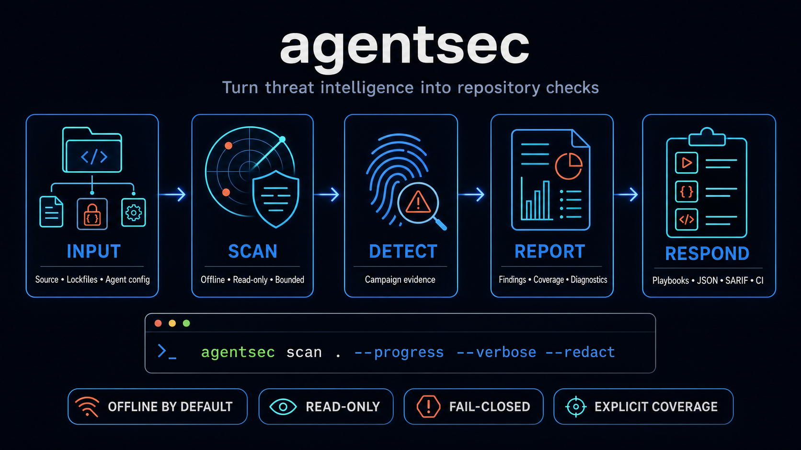

# AgentSec Triage

<table>
  <tr>
    <td width="64">
      <a href="https://www.florian.bruniaux.com/about/?utm_source=github&amp;utm_medium=readme&amp;utm_campaign=agentsec-triage"></a>
    </td>
    <td>
      <strong><a href="https://www.florian.bruniaux.com/about/?utm_source=github&amp;utm_medium=readme&amp;utm_campaign=agentsec-triage">Florian BRUNIAUX</a></strong> &middot; AI Founding Engineer @ <a href="https://methode-aristote.fr/">Méthode Aristote</a><br />
      13 years from developer to CTO / VP Eng &middot; <a href="https://www.florian.bruniaux.com/blog/?utm_source=github&amp;utm_medium=readme&amp;utm_campaign=agentsec-triage">Blog &#8599;</a> &middot; <a href="https://www.florian.bruniaux.com/projects/?utm_source=github&amp;utm_medium=readme&amp;utm_campaign=agentsec-triage">Projects &#8599;</a>
    </td>
  </tr>
</table>

[](https://github.com/FlorianBruniaux/agentsec-triage/actions/workflows/tests.yml)
[](https://www.python.org/)
[](CHANGELOG.md)

Turn sourced threat intelligence into deterministic checks for local
repositories. AgentSec scans one explicit root, reports what it inspected, and
fails closed when applicable evidence cannot be read reliably.

Scans are **read-only** and **offline by default**. AgentSec does not certify
that a repository, workstation, dependency set, or account is clean.



AgentSec is a public source repository in alpha. Install it from a checked-out
copy; no package or tagged release is authorized yet.

## Start here

| Goal | Command or guide | Result |
| --- | --- | --- |
| Install from source | [Installation guide](docs/installation.md) | Local `agentsec` command and runtime verification |
| Check the installation | `agentsec doctor` | Database, schema, and packaged-resource status |
| Scan one repository | `agentsec scan /path/to/repo --progress --verbose --redact` | Human verdict with phase and bounded progress details on `stderr` |
| Produce machine output | `agentsec scan /path/to/repo --format json --redact` | Versioned scan-result v2 JSON |
| Export for code scanning | `agentsec scan /path/to/repo --format sarif --redact > agentsec.sarif` | SARIF 2.1.0 with completion and coverage metadata |
| Explain one detector | `agentsec detectors explain shai-hulud-keyv` | Rules, inputs, sources, limits, and `not_scanned` capabilities |
| Scan an explicit list | `agentsec batch /repo/a /repo/b --format json --redact` | Ordered batch result with aggregate exit status |

Read the [examples and verdict guide](docs/examples.md) before automating the
result. Exit code `2` means incomplete coverage, not success.

## When to use AgentSec

Use AgentSec before trusting a repository with a coding agent, after a tracked
campaign disclosure, or in CI when you need repository-local evidence tied to
reviewed threat intelligence.

| Need | Use AgentSec? |
| --- | --- |
| Check supported lockfiles, package metadata, payload hashes, hooks, or skill instructions against an implemented campaign detector | **Yes** |
| Know which applicable inputs were inspected, skipped, unsupported, or unreadable | **Yes** |
| Find general application vulnerabilities, secrets, or every vulnerable dependency | **No.** Add SAST, secret scanning, and SCA tools. |
| Inspect running processes, network traffic, credentials, persistence, live MCP servers, or registry history | **No.** Use host and runtime controls. |

AgentSec differs from broad repository and agent scanners through traceability:
each active rule links a reviewed source, campaign evidence, a deterministic
fixture, a finding, stated coverage, and response guidance. Its current breadth
is smaller than several alternatives, so it should complement rather than
replace general security tooling. See
[when to use AgentSec and how it compares](docs/when-to-use.md) and the dated
[scanner ecosystem study](docs/ECOSYSTEM.md).

AgentSec grew from the threat database behind
[the Claude Code Guide security page](https://cc.bruniaux.com/security/). A
scan does not query that website: it uses a validated, versioned database
bundled with the installed source, then reports the database version in its
output. AgentSec exports reviewed metadata back to the guide and landing page,
and CI rejects feed drift. The page tracks more intelligence than the two
detector families currently implemented by the scanner.

## What it checks today

AgentSec currently ships two detector families. The wider intelligence catalogue
contains research that has not been promoted into executable checks.

| Detector | Repository evidence | Main inputs |
| --- | --- | --- |
| `shai-hulud-keyv` | Documented compromised package versions, payload hashes, lifecycle scripts, and repository startup hooks associated with the Shai-Hulud/Keyv campaign | Supported `npm`, `pnpm`, Yarn, and text Bun lockfiles; installed package metadata; `.claude` settings; VS Code tasks; regular-file SHA-256 |
| `clawhavoc-skill` | Exact bundled campaign domains in `SKILL.md` or explicitly delegated same-skill setup instructions | Repository-local `SKILL.md` and referenced Markdown setup files |

Run `agentsec detectors explain DETECTOR_ID --format json` for the current
coverage contract. Binary `bun.lockb`, Git history, remote repositories,
registry history, remote payloads, runtime behavior, host credentials, and host
processes are not inspected.

## Concrete examples

These examples come from inert test fixtures shipped with AgentSec.

| What AgentSec surfaces | Example | What it means |
| --- | --- | --- |
| Compromised dependency version | `critical / confirmed / package-lock.json / keyv@6.0.0` | The exact package-version pair matches bundled campaign intelligence. It proves the resolved version is present, not that its payload executed. |
| Campaign-correlated startup hook | `high / high / .claude/settings.json / SessionStart: node setup.mjs` | Opening the repository with the affected agent configuration may invoke a command associated with the campaign. Inspect the referenced file and investigate possible prior execution. |
| Suspicious but unconfirmed hook | `medium / review / .claude/settings.json / SessionStart: echo repository-ready` | A repository hook can execute automatically, but this command has no campaign correlation. Confirm its owner and purpose before changing it. |
| Delegated skill instruction | `high / high / setup-installation.md:3 / openclawcli.vercel.app` | `SKILL.md` delegates setup to a local file containing an exact campaign domain. Do not follow the instruction; verify the skill's origin and version. |
| Incomplete coverage | `error / bun.lockb / Unsupported binary Bun lockfile format` | This is a diagnostic, not a finding. AgentSec returns exit code `2` because it cannot inspect an applicable authoritative input. |

See [complete finding examples](docs/examples.md#concrete-findings-and-diagnostics)
for full output, every active rule, false-positive boundaries, and diagnostic
classes.

## Read the result

| Exit code | Meaning |
| --- | --- |
| `0` | Applicable checks completed and produced no finding. This is not a clean-system certificate. |
| `1` | At least one finding requires action or review. |
| `2` | The scan failed or applicable coverage is incomplete. Findings already collected remain in the report. |

Reports keep **findings**, **diagnostics**, **discovery exclusions**,
**per-detector coverage**, and **unsupported capabilities** separate. This
prevents a skipped input from being presented as a successful check.

Versioned [response playbooks](docs/response-playbooks/) separate evidence
collection, manual containment, remediation, and verification. AgentSec does
not perform destructive remediation.

## Scope and safety

The default `source` scope excludes installed dependencies, generated trees,
caches, binary assets, and VCS metadata while retaining supported lockfiles.
Choose a broader scope explicitly when the investigation needs it:

```bash
agentsec scan /path/to/repo --scope dependencies
agentsec scan /path/to/repo --scope repository
```

AgentSec does not execute target content, invoke Git on the target repository,
request the network during a scan, or follow filesystem indirection outside the
scan root. Unreadable, changed, unsupported, or budget-exceeding applicable
inputs make the result incomplete.

AgentSec is not an antivirus, EDR, general SAST, dependency scanner, or secret
scanner. Its result covers only the implemented detectors and supported inputs
reported by that run.

## Outputs and automation

- Human output for local review.
- [Scan-result v2 JSON](schemas/scan-result-v2.schema.json) and
  [batch-result v1 JSON](schemas/batch-result-v1.schema.json).
- SARIF 2.1.0 with AgentSec completion, coverage, diagnostic, and exclusion
  properties.
- A repository-local [GitHub Action](action.yml) that runs checked-out source,
  validates SARIF, and preserves exit codes.
- A versioned [public security feed](exports/security-feed.v1.json) mirrored into
  the Claude Code Ultimate Guide and its landing page, with drift rejected in
  CI.

Remote Action use remains blocked until a release is authorized. See the
[project overview](docs/project-overview.md) for the data flow, product
surfaces, sources of truth, and integration boundaries.

## Documentation

| Need | Document |
| --- | --- |
| Install and run the first scan | [Installation](docs/installation.md) |
| Interpret human, JSON, SARIF, and incomplete results | [Examples and verdicts](docs/examples.md) |
| Understand architecture and canonical files | [Project overview](docs/project-overview.md) |
| Decide when to use AgentSec or another control | [Usage and comparison guide](docs/when-to-use.md) |
| Respond to a finding | [Response playbooks](docs/response-playbooks/) |
| Review sources and dated events | [Security intelligence](docs/SECURITY-INTELLIGENCE.md) and [timeline](docs/SECURITY-TIMELINE.md) |
| Add a source, event, IOC, or detector | [Intelligence authoring](docs/intelligence-authoring.md) |
| Give the task to an LLM | [Copy-ready prompt](PROMPT.md) and [LLM index](llms.txt) |
| Review priorities and shipped work | [Roadmap](ROADMAP.md) and [changelog](CHANGELOG.md) |
| Report a vulnerability or incorrect result | [Security policy](SECURITY.md) |
| Contribute code or intelligence | [Contributing](CONTRIBUTING.md) |

The related educational security page is <https://cc.bruniaux.com/security/>.

## License status

Project-owned code and original documentation use the [MIT License](LICENSE).
The paths listed in [LICENSE-DATA.md](LICENSE-DATA.md) remain unavailable for
public redistribution while their separate rights and CC BY-SA 4.0 review is
open.

Public visibility does not authorize a package, tag, source archive, GitHub
Release, or redistribution of gated data. The blocking decisions are recorded
in [LICENSE-DECISION.md](LICENSE-DECISION.md).
