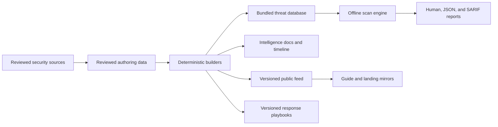

# AgentSec project overview

AgentSec connects four jobs that are often separated: maintain reviewed threat
intelligence, turn selected evidence into deterministic detector rules, scan
explicit repositories, and publish coverage-aware results. This document keeps
the implementation map out of the README's first-use path.

## Product surfaces

| Surface | Shipped behavior |
| --- | --- |
| Repository scanner | Bounded discovery over one explicit root with `source`, `dependencies`, or `repository` scope. Target content is read but never executed or modified. |
| Batch triage | Repeats the scanner for an explicit list of roots. It does not crawl parent directories looking for repositories. |
| Campaign detectors | Two stable detector families cover selected Shai-Hulud/Keyv evidence and the sourced ClawHavoc fake-prerequisite domain. |
| Coverage explanation | `agentsec detectors explain` exposes active rules, supported inputs, sources, limits, remediation, documented-only intelligence, and stable `not_scanned` capabilities. |
| Threat intelligence | Sourced authoring data generates the bundled runtime database, human-readable catalogue, dated event timeline, and public metadata feed. |
| Reports | Human output, scan-result v2 JSON, SARIF 2.1.0, and batch-result v1 keep findings separate from diagnostics, exclusions, detector coverage, and completion. |
| Response guidance | Versioned playbooks separate evidence collection, manual containment, remediation, and verification. AgentSec performs no destructive remediation. |
| Automation | A repository-local GitHub Action validates SARIF and preserves scanner exit classes. Remote consumption remains blocked until a release is authorized. |
| Consumer integration | A versioned security feed is mirrored byte for byte into the Claude Code Ultimate Guide and its landing page. CI rejects drift. |
| Quality and research | Deterministic fixtures, schema digests, package tests, cross-platform CI, controlled competitor benchmarks, and explicit `not_tested` states preserve the evidence boundary. |

## Data and execution flow

Builders validate the authoring records and generate committed artifacts. The
CLI loads bundled resources during a scan, discovers paths within explicit
budgets, runs applicable detectors, and records whether each check completed.
A finding produces exit code `1`; incomplete applicable coverage takes
precedence with exit code `2`.

## Sources of truth

| Concern | Canonical location |
| --- | --- |
| Detector intelligence and IOCs | [`data/threat-db.yaml`](../data/threat-db.yaml) |
| Sources and dated security events | [`data/intelligence/`](../data/intelligence/) |
| Scanner behavior | [`src/agentsec/`](../src/agentsec/), [`schemas/`](../schemas/), and [`tests/`](../tests/) |
| Response playbooks | [`data/response-playbooks.json`](../data/response-playbooks.json) |
| Guide and landing integration | [`exports/security-feed.v1.json`](../exports/security-feed.v1.json) |
| Shipped work and next priorities | [`CHANGELOG.md`](../CHANGELOG.md) and [`ROADMAP.md`](../ROADMAP.md) |
| Release and data-rights gate | [`LICENSE-DATA.md`](../LICENSE-DATA.md) and [`LICENSE-DECISION.md`](../LICENSE-DECISION.md) |

Generated Markdown and runtime JSON are committed artifacts, not authoring
sources. Builders and CI reject divergence from the canonical files.

## Intelligence is broader than detector coverage

The scanner and public intelligence feed share reviewed source material but
serve different purposes. Adding a source, event, CVE, campaign, or IOC does not
create an executable rule automatically.

Promotion into runtime coverage requires all of the following:

1. A repository-local signal supported by the cited source.
2. A deterministic rule with declared applicability and limits.
3. Positive, near-miss, malformed, and relevant confinement fixtures.
4. Regression tests and an explicit confidence level.
5. A response path that does not overstate compromise.

`agentsec detectors explain DETECTOR_ID --format json` reports active,
partial, documented-only, and `not_scanned` states without converting catalogue
size into a coverage claim.

## Report contracts

Scan JSON follows [scan-result v2](../schemas/scan-result-v2.schema.json).
Batch JSON follows [batch-result v1](../schemas/batch-result-v1.schema.json).
The historical [scan-result v1](../schemas/scan-result-v1.schema.json) remains
available as an earlier contract, but current CLI output does not conform to it.

SARIF uses the standard 2.1.0 envelope. AgentSec records completion,
diagnostics, discovery exclusions, detector coverage, and unsupported
capabilities under `agentsec.*` properties. Output format never changes the
scanner exit class.

The repository-local composite Action stages the report outside the scan root,
validates completion metadata, publishes the configured SARIF file, and returns
the scanner's exact `0`, `1`, or `2` code. It is not a remotely consumable
release.

## Consumer integration

The public feed contains versioned metadata and reviewed intelligence suitable
for the guide and landing page. It excludes the gated threat-database fields
listed in the data-license record.

The synchronization script writes byte-identical mirrors into the Claude Code
Ultimate Guide and its landing repository. AgentSec CI clones both public
consumers and rejects a changed digest. This verifies feed parity, not detector
coverage or landing deployment.

## Current release boundary

The source repository is public and the code is tested across Python 3.11,
3.12, and 3.13 on Linux, macOS, and Windows. The project remains alpha.

[`LICENSE-DECISION.md`](../LICENSE-DECISION.md) blocks package publication,
tags, GitHub Releases, source archives, and remote Action consumption until the
data rights and attribution review is resolved. Repository visibility does not
remove that gate.
